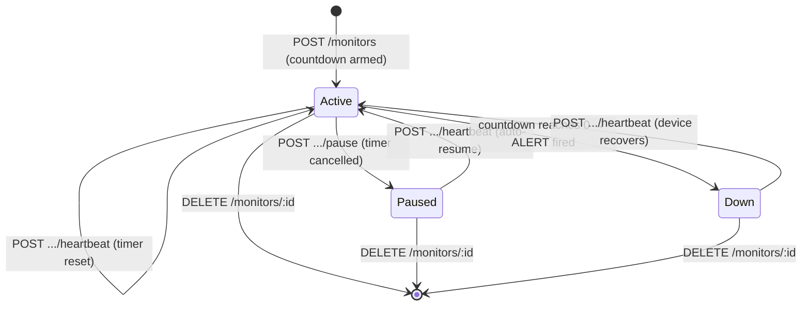
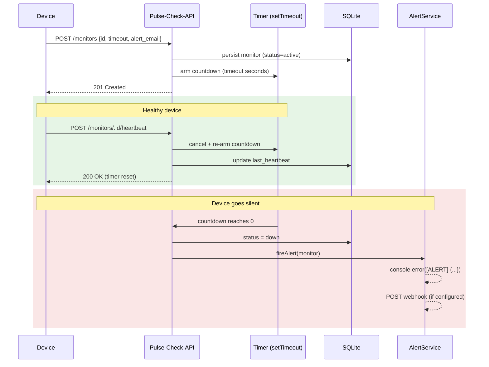

# Pulse-Check-API — "Watchdog" Sentinel

A **Dead Man's Switch** API for [CritMon Servers Inc.](#) — critical-infrastructure
monitoring for remote solar farms and unmanned weather stations in low-connectivity
areas.

Devices register a **monitor** with a countdown timer and are expected to send an
"I'm alive" **heartbeat** before that timer expires. If a heartbeat doesn't arrive in
time, the monitor's countdown reaches zero and the system **fires an alert** —
logging a structured critical event and optionally delivering a webhook — so a repair
team can be dispatched before anyone notices the silence by hand.

```jsonc
// What the world sees when a device goes dark:
[ALERT] {"ALERT":"Device solar-7 is down!","time":"2026-06-15T11:44:26.587Z", ...}
```

---

## Table of Contents

1. [Architecture](#architecture)
2. [Setup Instructions](#setup-instructions)
3. [API Documentation](#api-documentation)
4. [The Developer's Choice](#the-developers-choice-event-history--audit-trail)
5. [Beyond the Brief — engineering decisions](#beyond-the-brief--engineering-decisions)
6. [Project Structure](#project-structure)
7. [Configuration](#configuration)

---

## Architecture

### A few clear layers, one file each

The code is split by responsibility into six small files. Each later layer
depends only on the ones above it, and `server.js` is the single place that
wires them together — so "persist to SQLite instead of memory" is a one-line
change instead of a rewrite.

```
            HTTP (Express)              routes.js
   router · validation · errors            │
                  │                         ▼
            Monitor logic              monitor.js
   entity · actions · errors               │     (register · heartbeat · pause · …)
                  │                         ▼
            Storage + timers           store.js
   in-memory / SQLite repos                ▲
                  │                         │
            Side-effects               alert.js   (console + webhook)
                  │
            Wiring + startup           server.js  (the only cross-layer file)
            Settings                   config.js
```

### State Flow — the life of a Monitor



### Sequence — heartbeat vs. silence



### Why timers + persistence together?

A countdown is a live `setTimeout` — process-local state that **cannot** be written to
a database. So the SQLite repository persists monitor *state*, and on startup it
**rehydrates**: every still-active monitor has its countdown re-armed for the time
*remaining*, and any monitor whose deadline lapsed while the process was down fires its
alert immediately. State survives restarts; the watchdog never silently forgets a device.

---

## Setup Instructions

### Prerequisites

- **Node.js ≥ 22.5** (uses the built-in [`node:sqlite`](https://nodejs.org/api/sqlite.html)
  module — **no native compilation, no database server to install**). Check with `node -v`.

### Install & run

```bash
git clone https://github.com/specter-hafiz/Pulse-Check-API.git
cd Pulse-Check-API
npm install      # pure-JS deps only — express, helmet, express-rate-limit
npm start        # → http://localhost:3000
```

That's it. The SQLite database file is created automatically at `./data/pulse-check.db`
on first run; there is **nothing to migrate or configure** to get going.

| Command          | What it does                                              |
| ---------------- | --------------------------------------------------------- |
| `npm start`      | Start the server (persistent SQLite store)                |
| `npm run dev`    | Start with auto-reload (`node --watch`)                   |

> **No native build step.** An earlier design used `better-sqlite3`, but it needs a C++
> toolchain and a prebuilt binary matching your exact Node version — a common cause of
> "fails on clone". The built-in `node:sqlite` module can never fail to install, which
> keeps the clone-and-run experience bulletproof.

---

## API Documentation

Base URL: `http://localhost:3000`
All monitor routes are under `/api/monitors`. All request/response bodies are JSON.

### Quick reference

| Method   | Endpoint                        | Purpose                                   | Success |
| -------- | ------------------------------- | ----------------------------------------- | ------- |
| `POST`   | `/api/monitors`                 | Register a monitor (arms the countdown)   | `201`   |
| `POST`   | `/api/monitors/:id/heartbeat`   | Reset the countdown (auto-resumes/recovers) | `200`   |
| `POST`   | `/api/monitors/:id/pause`       | Pause monitoring (no alerts fire)         | `200`   |
| `GET`    | `/api/monitors`                 | List all monitors                         | `200`   |
| `GET`    | `/api/monitors/:id`             | Fetch a single monitor                    | `200`   |
| `GET`    | `/api/monitors/:id/history`     | **Audit trail of all events** ⭐          | `200`   |
| `DELETE` | `/api/monitors/:id`             | Remove a monitor + cancel its timer       | `200`   |
| `GET`    | `/health`                       | Liveness / store info                     | `200`   |

---

### 1. Register a Monitor — `POST /api/monitors`

**Request body**

| Field         | Type             | Required | Notes                                   |
| ------------- | ---------------- | -------- | --------------------------------------- |
| `id`          | string           | ✅       | Unique device identifier                |
| `timeout`     | positive integer | ✅       | Countdown length, in **seconds**        |
| `alert_email` | email string     | ✅       | Where the alert is addressed            |
| `webhook_url` | http(s) URL      | ❌       | Optional — POSTed to when the alert fires |

```bash
curl -X POST http://localhost:3000/api/monitors \
  -H "Content-Type: application/json" \
  -d '{"id":"device-123","timeout":60,"alert_email":"admin@critmon.com"}'
```

**`201 Created`**

```json
{
  "message": "Monitor \"device-123\" created. Countdown started: 60s.",
  "monitor": {
    "id": "device-123",
    "timeoutSeconds": 60,
    "alertEmail": "admin@critmon.com",
    "webhookUrl": null,
    "status": "active",
    "createdAt": "2026-06-15T11:44:24.531Z",
    "lastHeartbeat": null,
    "nextAlertAt": "2026-06-15T11:44:25.531Z"
  }
}
```

Errors: `400` validation failure (per-field messages), `409` id already exists.

---

### 2. Heartbeat — `POST /api/monitors/:id/heartbeat`

Resets the countdown to the full timeout. A heartbeat always means *"the device is
alive"*, so it also **un-pauses** a paused monitor and **recovers** a downed one.

```bash
curl -X POST http://localhost:3000/api/monitors/device-123/heartbeat
```

**`200 OK`** → returns the updated monitor.
Errors: `404` if the id does not exist.

---

### 3. Pause — `POST /api/monitors/:id/pause` (the "Snooze" button)

Stops the countdown completely so no alert can fire — for maintenance windows. Send a
heartbeat to resume.

```bash
curl -X POST http://localhost:3000/api/monitors/device-123/pause
```

**`200 OK`** → `status: "paused"`.
Errors: `404` unknown id, `409` already paused.

---

### 4. List — `GET /api/monitors`

```bash
curl http://localhost:3000/api/monitors
```

```json
{ "count": 1, "monitors": [ { "id": "device-123", "status": "active", ... } ] }
```

### 5. Fetch one — `GET /api/monitors/:id`

```bash
curl http://localhost:3000/api/monitors/device-123
```

Errors: `404` unknown id.

---

### 6. History — `GET /api/monitors/:id/history` ⭐ *Developer's Choice*

The full, ordered audit trail for a monitor.

```bash
curl http://localhost:3000/api/monitors/device-123/history
```

```json
{
  "id": "device-123",
  "count": 3,
  "events": [
    { "type": "registered", "message": "Monitor created with a 60s timeout.", "createdAt": "2026-06-15T11:44:24.535Z" },
    { "type": "heartbeat",  "message": "Countdown reset to 60s.",             "createdAt": "2026-06-15T11:44:24.574Z" },
    { "type": "alert",      "message": "Device device-123 is down — no heartbeat within 60s.", "createdAt": "2026-06-15T11:44:26.585Z" }
  ]
}
```

Event types: `registered`, `heartbeat`, `resumed`, `recovered`, `paused`, `alert`.
Errors: `404` unknown id.

---

### 7. Delete — `DELETE /api/monitors/:id`

```bash
curl -X DELETE http://localhost:3000/api/monitors/device-123
```

**`200 OK`**. Errors: `404` unknown id.

---

### Error format

Every error response is a consistent shape, so clients can branch on `type`:

```json
{ "error": "Monitor \"ghost\" not found.", "type": "MonitorNotFoundError" }
```

| Status | When                                              |
| ------ | ------------------------------------------------- |
| `400`  | Validation failure (includes a `errors[]` array)  |
| `404`  | Monitor / route not found                         |
| `409`  | Duplicate id, or pausing an already-paused monitor |
| `429`  | Rate limit exceeded on a write endpoint           |
| `500`  | Unexpected error (details logged, never leaked)   |

---

## The Developer's Choice: Event History & Audit Trail

> *"We value engineers who look for what's missing."*

**Feature added:** a persisted, append-only **event history** for every monitor,
exposed at `GET /api/monitors/:id/history`.

### Why this, specifically?

The brief's alert is *ephemeral* — it's a `console.log` that scrolls away. But CritMon's
real job is answering questions **after** an incident: *"When did the solar farm go
quiet? Was it flapping — up, down, up — before it failed? Did a technician pause it and
forget to resume?"*

A live status of `down` can't answer any of that. So I record every state transition —
`registered`, `heartbeat`, `paused`, `resumed`, `recovered`, `alert` — each with a
timestamp and message, into a dedicated `events` table that **cascade-deletes** with its
monitor. This turns the API from a momentary status light into a forensic timeline,
which is exactly what a support engineer dispatching a repair team actually needs.

It also showcases the architecture: history is a separate `EventRepository` (with both
in-memory and SQLite implementations) injected into the monitor actions, and the `down`
event is recorded by the same wiring (`server.js`) that fires the alert — so the audit
trail and the side-effect can never drift out of sync.

---

## Beyond the Brief — engineering decisions

These go past the acceptance criteria; each is here for a reason a reviewer can poke at:

- **SQLite persistence (default store).** In-memory state dies on restart — for a
  *monitoring* product that's a silent failure. The `SqliteMonitorRepository` persists
  state and **rehydrates timers on boot**, firing any alert whose deadline lapsed while
  the process was down. Because of the clean boundaries, this was an additive change:
  a new repository + one wiring line in `server.js`. Set `STORE=memory` to opt back out.
- **Webhook delivery.** Beyond the required console alert, a monitor may register a
  `webhook_url` that receives the alert payload (5s timeout, best-effort, never crashes
  the alert path).
- **Security headers + rate limiting.** `helmet` sets hardened HTTP headers; the write
  endpoints (`POST`s) are rate-limited per IP via `express-rate-limit` (100/min by
  default) to blunt abuse and runaway clients.
- **Graceful shutdown.** `SIGINT`/`SIGTERM` drain in-flight requests, cancel timers, and
  close the database handle cleanly.
- **Defence-in-depth validation.** Declarative per-field body validation returns precise
  `400`s; the JSON body is size-capped (16 kB).

---

## Try it locally

No test suite ships with the project — verify behaviour by running it and poking the
endpoints (see [API Documentation](#api-documentation) for full examples):

```bash
npm start
# in another terminal:
curl -X POST http://localhost:3000/api/monitors \
  -H "Content-Type: application/json" \
  -d '{"id":"device-123","timeout":3,"alert_email":"admin@critmon.com"}'
# wait > 3s without sending a heartbeat, then watch the server log:
#   [ALERT] {"ALERT":"Device device-123 is down!", ...}
curl http://localhost:3000/api/monitors/device-123/history   # the full audit trail
```

---

## Project Structure

Six small files, each one layer of the app. Read them top-to-bottom in this order:

```
config.js     Environment-driven settings (the only place that reads process.env)
monitor.js    The core: domain errors, the Monitor entity (pure state rules), and
              the monitor actions (register · heartbeat · pause · get · list ·
              delete · history)
store.js      Persistence + live countdown timers — interchangeable in-memory and
              SQLite repositories, the timer registry, and the SQLite schema
alert.js      What happens when a monitor goes down: console alert + webhook POST
routes.js     HTTP layer: body validation, the thin controllers, the error handler
server.js     Composition root — wires store → actions → HTTP, listens, shuts down
```

---

## Configuration

All optional — sensible defaults are built in (see `config/index.js`). Copy
`.env.example` to `.env` to override.

| Variable               | Default                  | Description                                |
| ---------------------- | ------------------------ | ------------------------------------------ |
| `PORT`                 | `3000`                   | HTTP port                                  |
| `NODE_ENV`             | `development`            | `development` \| `production` \| `test`    |
| `STORE`                | `sqlite`                 | `sqlite` (persistent) \| `memory` (volatile) |
| `DATABASE_FILE`        | `./data/pulse-check.db`  | SQLite file path (auto-created)            |
| `RATE_LIMIT_WINDOW_MS` | `60000`                  | Rate-limit window for writes               |
| `RATE_LIMIT_MAX`       | `100`                    | Max write requests per window per IP       |

---